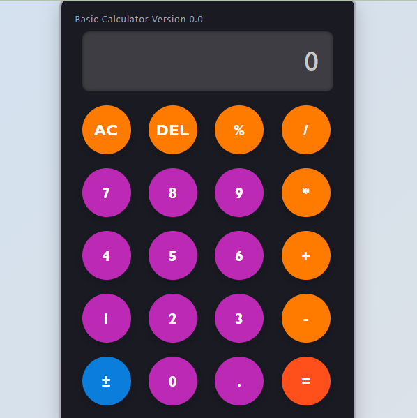

# Basic-Calculator
A simple calculator built with HTML, CSS, and JavaScript. It provides basic arithmetic operations and a clean UI.

## Features
- Add, subtract, multiply, divide, and calculate percentages.
- Clear (AC) and delete (DEL) functionality.
- Toggle positive/negative numbers.
- User-friendly and responsive design.

## Screenshots

